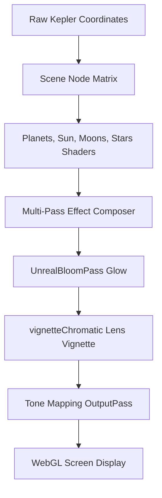

# GLSL Shaders Architecture

This directory houses all custom GLSL vertex and fragment shaders driving the cinematic rendering effects of the Orbital Insight universe engine.

## 📊 Shader Programs List

| Shader Program | Description | Key Uniforms / Inputs |
|----------------|-------------|-----------------------|
| `stars` | Twinkling starfield background drawing 100k+ stellar points. | `uTime`, `uSize` |
| `atmosphere` | Rayleigh limb scattering glows around planetary meshes. | `uAtmosphereColor`, `uSunDirection` |
| `earth` | Dynamic day-to-night surface texture mixing based on sun exposure angles. | `uSunDirection`, `uDayTexture`, `uNightTexture` |
| `exoplanet` | Procedural exoplanet visual flows (lava, oceans, glaciers) utilizing 4-octave 3D FBM noise. | `uTime`, `uPlanetType`, `uSeed` |
| `nebula` | Displaced vertex waves representing volumetric gaseous stellar nurseries. | `uTime`, `uNebulaColor` |
| `rings` | Saturn's rings rendering with radial alpha transparency and backlight scattering. | `uRingTexture`, `uSunDirection` |
| `sun` | Surface convection cell patterns and HDR glow output. | `uTime`, `uGranulation` |
| `vignetteChromatic` | Post-processing cinematic lens vignetting and screen-edge chromatic shift. | `tDiffuse`, `uAberrationOffset`, `uVignetteDarkness` |
| `warp` | Radial star blur lines and tunnel visual distortion during spacecraft hyper warp. | `uTime`, `uWarpSpeed`, `uProgress` |

## 🛠 Shader Pipeline Flow

